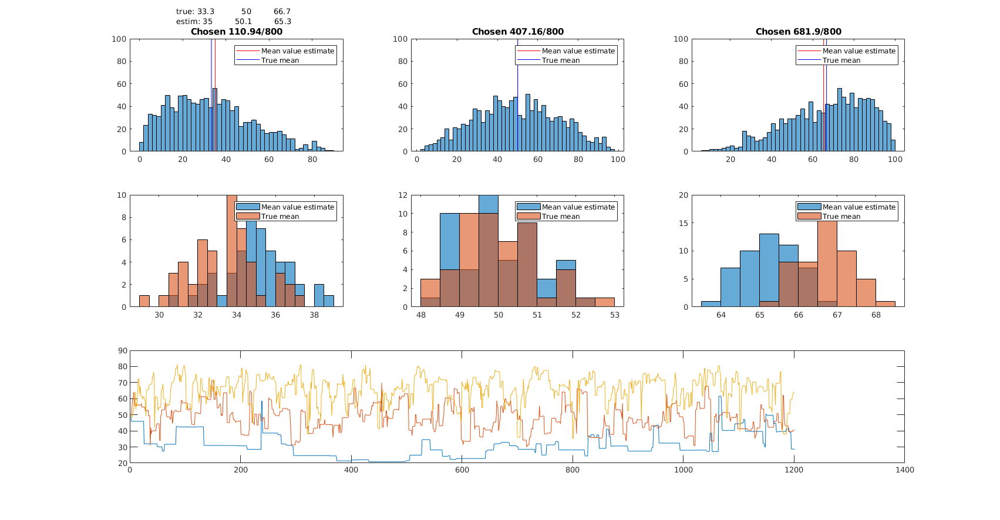
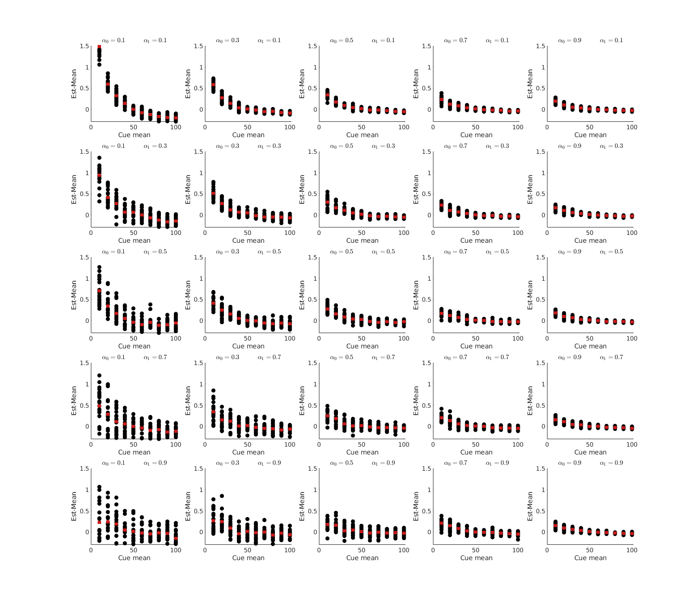
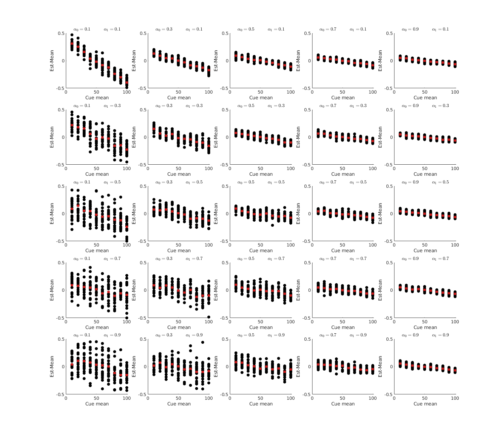

Here, I outline overview of our chase for the problem that the basic pedlr model shifts mean estimate in the same direction.
Right click on image and 'open in new tab' to make it bigger.

---

### Problem 1 Definition
While it was anticipated that increased learning from large prediction errors will shift means towards their tails, this does not occur when a decision rule (softmax/greedy) is introduced. Both effects are to the left of the mean (or towards less sampled cues).

#### Clues
  1. **Clue 1**: Force choice fixes the problem
    - Sampling all cues the same amount of times makes the bias in the predicted way
  2. **Clue 2**: Averaging over only trials when the cue was chosen fixes the problem
    - I probably made a mistake first time I checked, but when I try now the problem above is gone, BUT a new bias arises: The lowest cue is actually slightly over-estimated (see problem 2).
    

### Problem 2 Definition
There appears to be consistently larger bias in the lower distribution. To examine this I simulated data:
  - 30 simulations per condition
  - varied $\alpha_0$ and $\alpha_1$ between 0.1 and 0.9 in steps of 0.2
  - averaged over values where the cue was chosen (before update)
  - had 10 bandits with means ranging from 10 to 100
  - the distributions used to generate the data were unbiased (symmetrical) Beta(2.5, 2.5), centered at the means above
  
Forced choice
  

It seems that there is a general bias in the lower end that goes away as alpha0 increases. Remember that thes are symmetrical distributions, so here we shouldn't expect any deviations due to alpha1.

### A problematic thought
Taking mean over the value estimates might not be the correct way to look at this. In a way RW is already a version of running mean, so if we take mean over those we are taking mean of running means.
